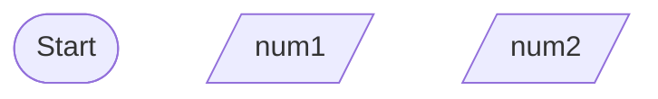

# Tutorial 1
## Part I

### Question 1
#### IPO Model
Input:
- Number 1
- Number 2
  
Process:
- Assign variable to Number 1
- Assign variable to Number 2
- Multiply both numbers

Output:
- Result of Calculation

#### Pseudocode
1. Get the both numbers from user.
2. Mutliply both numbers.
3. Print the result of multiplication.

#### Flowchart

